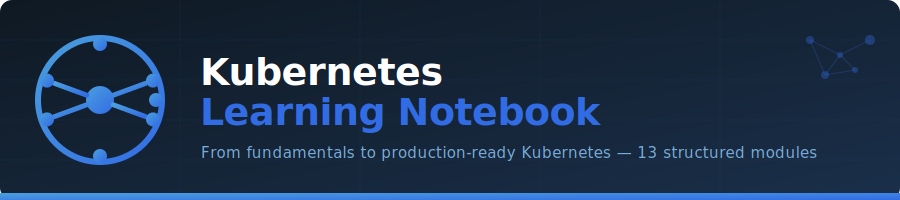

# Best Practices



A curated, CKA-level reference of best practices across every major Kubernetes domain. These recommendations reflect both exam expectations and production-grade engineering standards. Each section maps directly to a module in this notebook.

---

## Table of Contents

- [Cluster Architecture & Setup](#1-cluster-architecture--setup)
- [Workloads & Pods](#2-workloads--pods)
- [Deployments & Rollouts](#3-deployments--rollouts)
- [Configuration Management](#4-configuration-management)
- [Networking](#5-networking)
- [Storage](#6-storage)
- [Security](#7-security)
- [Observability & Monitoring](#8-observability--monitoring)
- [Autoscaling](#9-autoscaling)
- [Scheduling](#10-scheduling)
- [StatefulSets & Operators](#11-statefulsets--operators)
- [Helm & Package Management](#12-helm--package-management)
- [CI/CD & GitOps](#13-cicd--gitops)
- [Troubleshooting](#14-troubleshooting)
- [General kubectl Habits](#15-general-kubectl-habits)

---

## 1. Cluster Architecture & Setup

- **Use kubeadm for reproducible cluster bootstrapping** — it enforces sane defaults and is the standard tool tested on the CKA exam.
- **Always back up etcd before any cluster upgrade or destructive change.**
  ```bash
  ETCDCTL_API=3 etcdctl snapshot save /backup/etcd-snapshot.db \
    --endpoints=https://127.0.0.1:2379 \
    --cacert=/etc/kubernetes/pki/etcd/ca.crt \
    --cert=/etc/kubernetes/pki/etcd/server.crt \
    --key=/etc/kubernetes/pki/etcd/server.key
  ```
- **Run control plane components as static Pods** (default with kubeadm) — they are managed by kubelet and automatically restarted without a scheduler.
- **Use odd numbers of control plane nodes** (1, 3, 5) to maintain etcd quorum. Three nodes tolerate one failure; five tolerate two.
- **Separate etcd from the control plane** in large or critical clusters to reduce blast radius.
- **Enable audit logging** on the API server to record who did what and when — required for compliance and forensic investigation.
- **Upgrade one minor version at a time** (`v1.28 → v1.29`). Never skip minor versions. Always upgrade control plane nodes before worker nodes.

---

## 2. Workloads & Pods

- **Never run bare Pods in production.** Always wrap them in a Deployment, StatefulSet, DaemonSet, or Job so the controller can reschedule on failure.
- **Always set `resources.requests` and `resources.limits`** on every container. Without requests, the scheduler has no placement signal. Without limits, a noisy-neighbor can starve other workloads.
  ```yaml
  resources:
    requests:
      cpu: "100m"
      memory: "128Mi"
    limits:
      cpu: "500m"
      memory: "256Mi"
  ```
- **Set both `readinessProbe` and `livenessProbe`** on every long-running container:
  - `readinessProbe` — controls when traffic is routed to the Pod.
  - `livenessProbe` — controls when the container is restarted.
  - Add a `startupProbe` for slow-starting applications to avoid premature liveness kills.
- **Use `imagePullPolicy: IfNotPresent`** in production. `Always` adds latency; `Never` is too rigid. Pin images to a specific digest or immutable tag (e.g., `app:1.4.2`, never `app:latest`).
- **Set `terminationGracePeriodSeconds`** to a value that gives the application enough time to drain connections cleanly (default is 30 s).
- **Define Pod Disruption Budgets (PDBs)** for every critical workload to protect availability during node drains and cluster upgrades.
  ```yaml
  apiVersion: policy/v1
  kind: PodDisruptionBudget
  metadata:
    name: my-app-pdb
  spec:
    minAvailable: 2
    selector:
      matchLabels:
        app: my-app
  ```
- **Use `securityContext` at both Pod and container level** — run as non-root, drop all capabilities, set `readOnlyRootFilesystem: true` where possible.

---

## 3. Deployments & Rollouts

- **Use `RollingUpdate` strategy** (the default) for zero-downtime deployments. Tune `maxSurge` and `maxUnavailable` to balance speed vs. availability.
- **Set `revisionHistoryLimit`** to a meaningful number (e.g., `5`) to keep rollback history without cluttering etcd.
- **Annotate changes with `--record` or via `kubernetes.io/change-cause`** to make rollout history human-readable.
  ```bash
  kubectl annotate deployment my-app kubernetes.io/change-cause="bumped image to v1.4.2"
  ```
- **Test rollbacks in staging before production.** Know the command by heart:
  ```bash
  kubectl rollout undo deployment/my-app --to-revision=2
  ```
- **Use `minReadySeconds`** to slow down a rollout and give each new Pod time to prove it is healthy before the next batch is replaced.
- **Prefer Deployments over ReplicaSets directly** — Deployments add rollout management and history on top of ReplicaSets.

---

## 4. Configuration Management

- **Separate config from code.** Use ConfigMaps for non-sensitive configuration and Secrets for sensitive values — never bake them into container images.
- **Mount Secrets as volumes instead of environment variables** where possible. Environment variables can leak into logs and child processes.
- **Enable Secret encryption at rest** (`EncryptionConfiguration` on the API server) to protect Secret data in etcd.
- **Use `envFrom` with a prefix** to namespace environment variables and avoid collisions:
  ```yaml
  envFrom:
    - configMapRef:
        name: app-config
      prefix: APP_
  ```
- **Treat ConfigMaps and Secrets as immutable in production** — use `immutable: true` to prevent accidental in-place changes and improve kube-apiserver performance at scale.
- **Version-stamp your ConfigMaps and Secrets** (e.g., `app-config-v3`) and update Pod templates to reference the new name. This triggers a rolling restart automatically.
- **Never store secrets in Git.** Use an external secrets manager (Vault, AWS Secrets Manager, Sealed Secrets) and sync them into Kubernetes Secrets at deploy time.

---

## 5. Networking

- **Understand the four Kubernetes networking rules by heart** (Pod-to-Pod, Pod-to-Service, external-to-Service, outbound) — the CKA exam tests this conceptually.
- **Use `ClusterIP` by default.** Only expose a Service as `NodePort` or `LoadBalancer` when there is a clear external-access requirement.
- **Prefer Ingress controllers over multiple LoadBalancer Services** — a single Ingress controller with path/host-based routing is far more cost-efficient in cloud environments.
- **Always define Network Policies** to implement a default-deny posture, then explicitly allow required traffic. Without Network Policies, all Pods can reach all other Pods.
  ```yaml
  # Default deny all ingress in a namespace
  apiVersion: networking.k8s.io/v1
  kind: NetworkPolicy
  metadata:
    name: default-deny-ingress
  spec:
    podSelector: {}
    policyTypes:
      - Ingress
  ```
- **Use Fully Qualified Domain Names (FQDNs)** inside the cluster (`my-svc.my-namespace.svc.cluster.local`) to avoid DNS resolution surprises across namespaces.
- **Validate DNS resolution early** when debugging connectivity — `kubectl exec` into a Pod and run `nslookup` or `dig` before suspecting the application.
- **Choose your CNI plugin deliberately** — Calico for Network Policy enforcement, Flannel for simplicity, Cilium for eBPF-based observability. Know the trade-offs.

---

## 6. Storage

- **Never use `hostPath` in production** — it ties a Pod to a specific node and creates a security risk. Use PersistentVolumeClaims instead.
- **Use StorageClasses and dynamic provisioning** rather than manually pre-creating PersistentVolumes. This scales and reduces ops toil.
- **Set an appropriate `reclaimPolicy`:**
  - `Retain` — for stateful databases and data you want to recover manually.
  - `Delete` — for ephemeral workloads where auto-cleanup is acceptable.
- **Match `accessModes` to your workload:**
  - `ReadWriteOnce (RWO)` — single-node read/write (most block storage).
  - `ReadOnlyMany (ROX)` — multiple nodes, read-only.
  - `ReadWriteMany (RWX)` — multiple nodes, read/write (requires NFS or CSI driver support).
- **Size PVCs conservatively and monitor usage.** Running out of disk space in a StatefulSet is one of the most painful production incidents.
- **Use `volumeClaimTemplates` in StatefulSets** so each Pod replica gets its own dedicated PVC — never share a single RWO PVC across replicas.
- **Back up stateful data independently of Kubernetes** — Velero is the standard tool for cluster-level backup and restore.

---

## 7. Security

- **Apply least-privilege RBAC.** Grant only the permissions a ServiceAccount actually needs. Start by denying everything, then add back what is required.
  ```yaml
  # Prefer Role (namespace-scoped) over ClusterRole wherever possible
  kind: Role
  rules:
    - apiGroups: [""]
      resources: ["pods"]
      verbs: ["get", "list"]
  ```
- **Create dedicated ServiceAccounts** for each workload. Never use the `default` ServiceAccount — it makes audit trails ambiguous.
- **Disable auto-mounting of the ServiceAccount token** unless the application explicitly needs to call the Kubernetes API:
  ```yaml
  spec:
    automountServiceAccountToken: false
  ```
- **Use Pod Security Admission (PSA)** with the `restricted` profile for sensitive namespaces and `baseline` as a minimum for all others (PodSecurityPolicy is removed as of v1.25).
- **Scan container images for vulnerabilities** before pushing them to a registry (Trivy, Grype). Enforce this in CI.
- **Use read-only root filesystems** and avoid running containers as root:
  ```yaml
  securityContext:
    runAsNonRoot: true
    runAsUser: 1000
    readOnlyRootFilesystem: true
    allowPrivilegeEscalation: false
    capabilities:
      drop: ["ALL"]
  ```
- **Rotate Secrets and TLS certificates regularly.** Use cert-manager to automate certificate issuance and renewal.
- **Restrict access to the etcd endpoint** — anyone with direct etcd access can read all Secrets in plaintext (unless encryption at rest is enabled).

---

## 8. Observability & Monitoring

- **Log to stdout/stderr** — never write logs to files inside containers. Kubernetes and every major logging backend expect the standard streams.
- **Use structured logging (JSON)** so logs can be parsed, filtered, and indexed efficiently by tools like Loki, Elasticsearch, or CloudWatch.
- **Deploy the Metrics Server** as a minimum baseline for `kubectl top` and HPA to function.
- **Use Prometheus + Grafana** as the production-grade monitoring stack. Instrument applications with the Prometheus client library.
- **Alert on symptoms, not causes** — alert on high error rate and high latency (user-visible impact), not on CPU usage alone.
- **Implement distributed tracing** (OpenTelemetry → Jaeger/Tempo) for microservices to correlate requests across service boundaries.
- **Set up liveness, readiness, and startup probe metrics** — failed probes are a leading indicator of imminent Pod churn.
- **Retain logs outside the cluster.** Container logs are lost when a Pod is deleted. Ship them to an external store (Loki, Elasticsearch, S3) with Fluentd or Fluent Bit.

---

## 9. Autoscaling

- **Set accurate `requests`** — HPA and VPA both depend on request-relative utilization. Inaccurate requests produce wildly incorrect scaling behavior.
- **Prefer HPA for stateless workloads** that scale horizontally (web servers, API services). Prefer VPA for workloads with variable but bounded resource needs (batch jobs, ML inference).
- **Do not use HPA and VPA in `Auto` mode on the same Deployment** — they will conflict on CPU/memory targets. Use VPA in `Off` or `Initial` mode alongside HPA.
- **Set conservative HPA min/max replicas.** A min of `2` ensures availability during single-node failures; the max prevents runaway scaling costs.
  ```yaml
  spec:
    minReplicas: 2
    maxReplicas: 20
  ```
- **Use KEDA for event-driven autoscaling** (queue depth, Kafka lag, cron schedules) where standard CPU/memory metrics are insufficient signals.
- **Combine HPA with Cluster Autoscaler** — HPA scales Pods, Cluster Autoscaler scales nodes. Together they handle both dimensions of elasticity.
- **Add scale-down stabilization windows** to prevent thrashing during traffic spikes:
  ```yaml
  behavior:
    scaleDown:
      stabilizationWindowSeconds: 300
  ```

---

## 10. Scheduling

- **Use `nodeSelector` for simple, stable node targeting** (e.g., `disktype=ssd`). Use `nodeAffinity` for more expressive rules with `preferred` and `required` semantics.
- **Use taints and tolerations to reserve nodes** for specific workloads (GPU nodes, spot/preemptible nodes, monitoring infrastructure):
  ```bash
  kubectl taint nodes node1 dedicated=gpu:NoSchedule
  ```
- **Use `podAntiAffinity` to spread replicas** across nodes and availability zones — this is the single most important scheduling practice for high availability.
  ```yaml
  affinity:
    podAntiAffinity:
      requiredDuringSchedulingIgnoredDuringExecution:
        - labelSelector:
            matchLabels:
              app: my-app
          topologyKey: "kubernetes.io/hostname"
  ```
- **Use `topologySpreadConstraints`** as a modern, more flexible replacement for podAntiAffinity when you need even distribution across zones.
- **Assign PriorityClasses** to workloads so the scheduler knows what to preempt during resource contention. Critical system workloads should have the highest priority.
- **Use ResourceQuotas and LimitRanges** per namespace to prevent any one team or workload from monopolizing cluster resources.

---

## 11. StatefulSets & Operators

- **Understand StatefulSet guarantees:** ordered Pod creation/deletion, stable network identities (`pod-0`, `pod-1`), and stable persistent storage per replica.
- **Use headless Services** (`clusterIP: None`) with StatefulSets to get stable DNS entries for each Pod (`pod-0.svc.namespace.svc.cluster.local`).
- **Never scale a StatefulSet down abruptly** in a quorum-sensitive system (Kafka, ZooKeeper, etcd). Scale down one replica at a time and verify health between steps.
- **Use `podManagementPolicy: Parallel`** only when the application can handle parallel startup (e.g., stateless read replicas). Use `OrderedReady` (default) for quorum-sensitive systems.
- **Prefer Operators for complex stateful workloads** (databases, message queues) — they encode operational knowledge (failover, backup, schema migration) that would otherwise live in runbooks.
- **Use well-maintained community Operators** (e.g., CloudNativePG for Postgres, Strimzi for Kafka) rather than building from scratch unless you have a very specific requirement.
- **Understand CRDs deeply** — Operators expose their configuration via CRDs. Know how to inspect CRD schemas with `kubectl explain`.

---

## 12. Helm & Package Management

- **Use Helm for repeatable, parameterized deployments** of complex applications — but keep your `values.yaml` files in version control.
- **Separate environment-specific values** into dedicated files (`values-staging.yaml`, `values-prod.yaml`) and pass them with `-f`.
- **Pin chart versions** in CI/CD pipelines (`--version 5.2.1`) to ensure reproducibility. Never rely on `latest`.
- **Review chart templates before installing** — use `helm template` to render the manifests locally and `helm lint` to catch errors:
  ```bash
  helm template my-release ./my-chart -f values-prod.yaml | kubectl apply --dry-run=client -f -
  ```
- **Use `helm diff`** (via the helm-diff plugin) before every `helm upgrade` to understand exactly what will change.
- **Store Helm state in a dedicated namespace** and never manually edit resources managed by Helm — it will cause drift and confuse future upgrades.
- **Implement Helm chart testing** with `helm test` to validate a release after deployment.

---

## 13. CI/CD & GitOps

- **Treat the Git repository as the single source of truth** for all Kubernetes manifests. The cluster state should always be reconcilable from Git.
- **Use GitOps controllers (ArgoCD, Flux)** to close the loop between Git and the cluster — they continuously reconcile, detect drift, and alert on out-of-band changes.
- **Never `kubectl apply` directly to production** from a local machine or ad-hoc CI job. All changes must flow through a reviewed and auditable Git commit.
- **Separate the CI pipeline (build + test) from the CD pipeline (deploy)** — CI produces an artifact; CD promotes it through environments.
- **Use image digest pinning** in GitOps manifests rather than mutable tags — this makes deployments fully reproducible and auditable.
- **Implement progressive delivery** (canary, blue-green) with Argo Rollouts or Flagger to reduce blast radius of bad releases.
- **Protect the production branch** with required code reviews, status checks, and signed commits to prevent unauthorized deployments.

---

## 14. Troubleshooting

- **Follow a structured debugging flow** — do not jump to conclusions. Work from the outside in: Service → Endpoints → Pod → Container → Logs → Events.
  ```bash
  kubectl get events --sort-by='.lastTimestamp' -n <namespace>
  kubectl describe pod <pod-name>
  kubectl logs <pod-name> --previous   # logs from last crashed container
  ```
- **Know the common failure patterns cold for the CKA exam:**
  | Symptom | First Command |
  |---------|---------------|
  | `CrashLoopBackOff` | `kubectl logs <pod> --previous` |
  | `ImagePullBackOff` | `kubectl describe pod <pod>` → check image name/tag/registry credentials |
  | `Pending` | `kubectl describe pod` → check node resources, taints, affinity |
  | `OOMKilled` | `kubectl describe pod` → increase `memory.limits` |
  | Service not routing | `kubectl get endpoints <svc>` → verify label selector matches Pod labels |
- **Use `kubectl exec` to debug from inside** — run `curl`, `nslookup`, `wget`, or `env` directly in the context of the failing Pod.
- **Use ephemeral debug containers** (`kubectl debug`) to attach a sidecar with debug tools to a running Pod without restarting it:
  ```bash
  kubectl debug -it <pod-name> --image=busybox --target=<container-name>
  ```
- **Check kubelet and containerd logs on the node** for failures that do not surface at the API server level:
  ```bash
  journalctl -u kubelet -f
  ```
- **Use `--dry-run=client -o yaml`** to generate manifests quickly during the exam without memorizing full YAML schemas:
  ```bash
  kubectl create deployment nginx --image=nginx:1.25 --dry-run=client -o yaml > deploy.yaml
  ```

---

## 15. General kubectl Habits

- **Set your context and namespace explicitly** before running destructive commands — a wrong context in production is one of the most common and costly mistakes.
  ```bash
  kubectl config use-context prod-cluster
  kubectl config set-context --current --namespace=my-app
  ```
- **Use `--dry-run=client` and `-o yaml`** to preview resource creation before applying it.
- **Alias frequently used commands** to save time, especially during the CKA exam:
  ```bash
  alias k=kubectl
  export do="--dry-run=client -o yaml"
  ```
- **Use `kubectl explain`** to look up API field documentation without leaving the terminal — this is allowed and expected on the CKA exam:
  ```bash
  kubectl explain pod.spec.containers.securityContext
  ```
- **Use `kubectl get all -n <namespace>`** to get a broad overview of what is running in a namespace quickly.
- **Use JSONPath or `-o custom-columns`** to extract specific fields from large outputs:
  ```bash
  kubectl get pods -o jsonpath='{.items[*].metadata.name}'
  ```
- **Label everything consistently.** At minimum, apply `app`, `version`, and `env` labels to all resources. This makes selectors, Network Policies, and debugging significantly easier.
- **Prefer declarative (`kubectl apply`) over imperative (`kubectl create/edit`)** for all resources you intend to keep — imperative commands leave no audit trail and cannot be stored in Git.